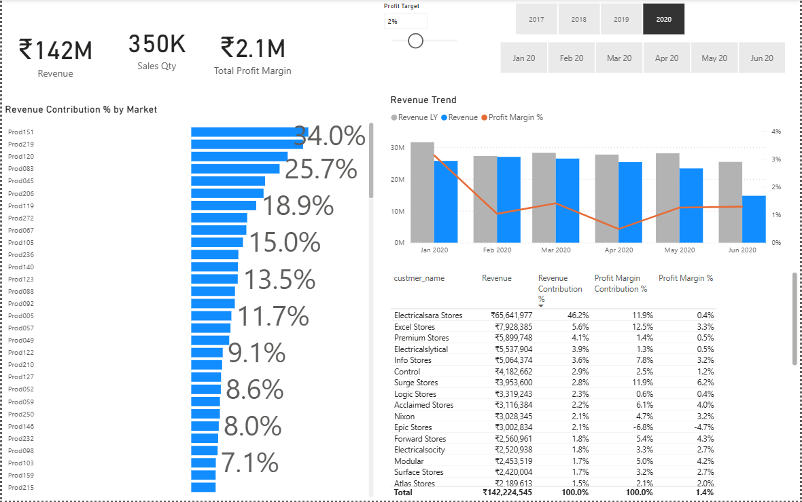
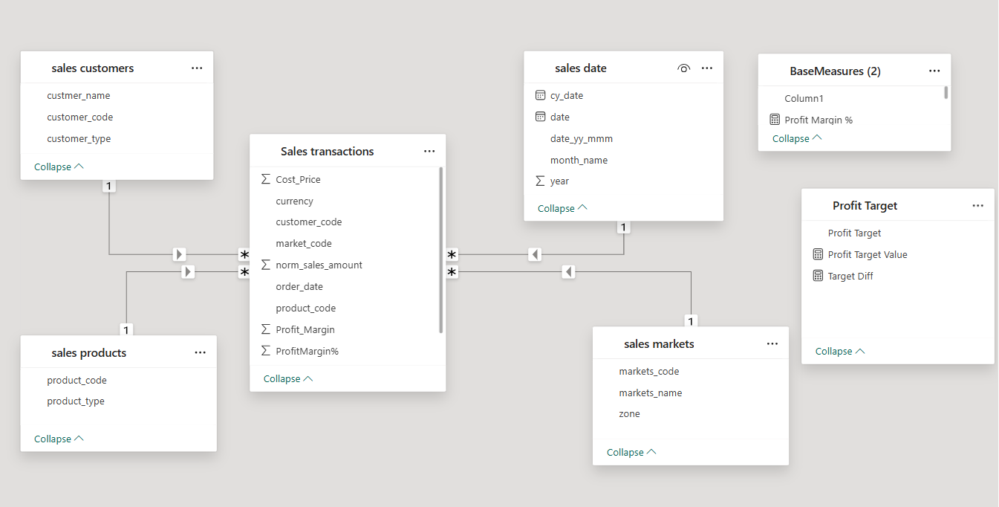

# Sales & Profit Analysis Dashboard – Power BI + SQL

This project is a fully interactive **Sales & Profit Dashboard** developed in **Power BI**, using data extracted from a SQL-based data warehouse. It allows users to explore revenue trends, profit margins, product and market contributions, and customer segmentation for business decision-making.

---

## Dashboard Preview

---

## Features

- ** KPI Cards** – Instant insight into:
  - Revenue, Quantity, Margin

- ** Revenue Trend Visualization **  
  Monthly comparison of revenue vs. previous year with dynamic profit margin overlay.

- ** Top Product Contribution**  
  Products ranked by revenue share (%), highlighting key performers.

- ** Customer Segmentation Table**  
  Profit margin %, revenue %, and detailed breakdown by customer.

- ** Profit Margin Target**  
  Use the slider to dynamically analyze performance vs. margin targets.

- ** Time Slicers**  
  Filter insights by year and month (e.g., Jan 2020 – Jun 2020).

---

## Data Model

 

---

## 📈 Use Case

Ideal for:
- Sales and Marketing departments to monitor targets
- Business Analysts for profitability tracking
- Management teams for data-driven decision-making
